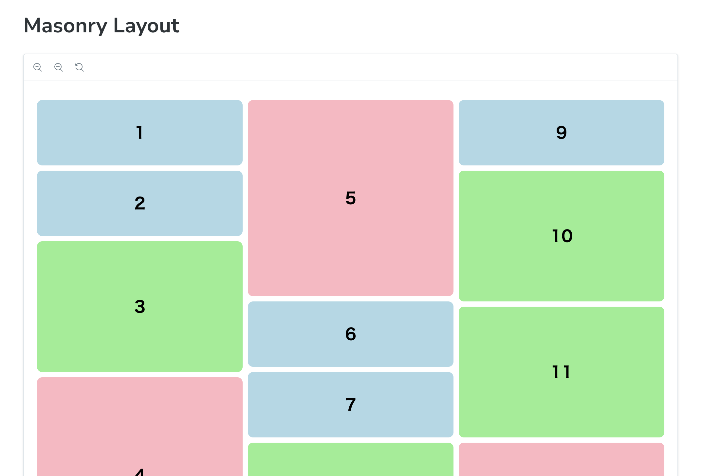
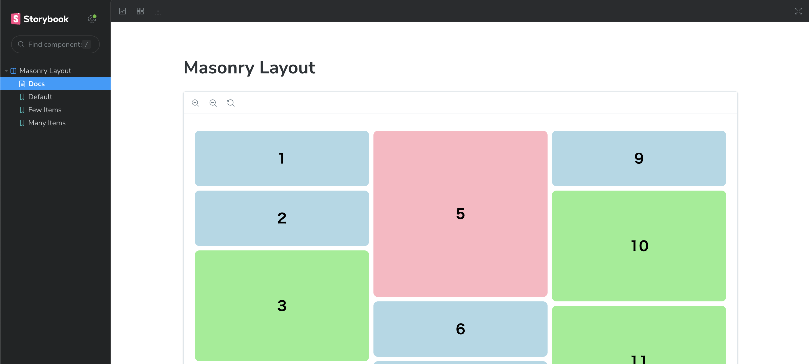

# 2023-11-simple-masonry-layout

A simple masonry layout implementation.

Note: Since the CSS `column-count` property is used, the elements will be arranged vertically.



## Run in your local environment

```sh
npm install
npm run storybook
```


